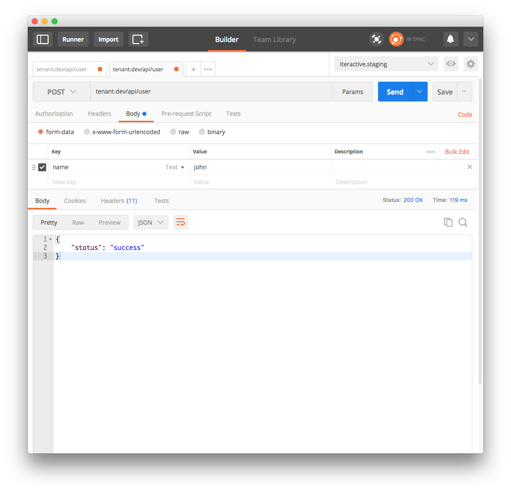
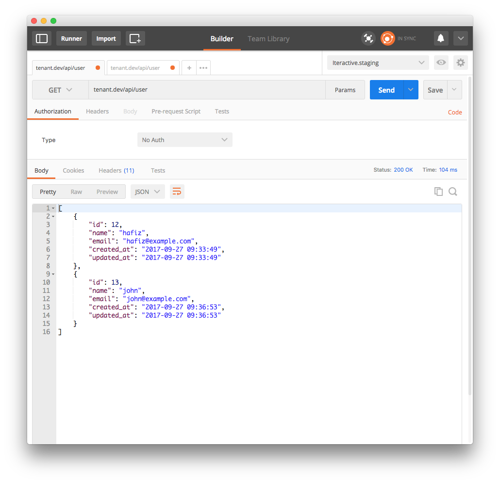
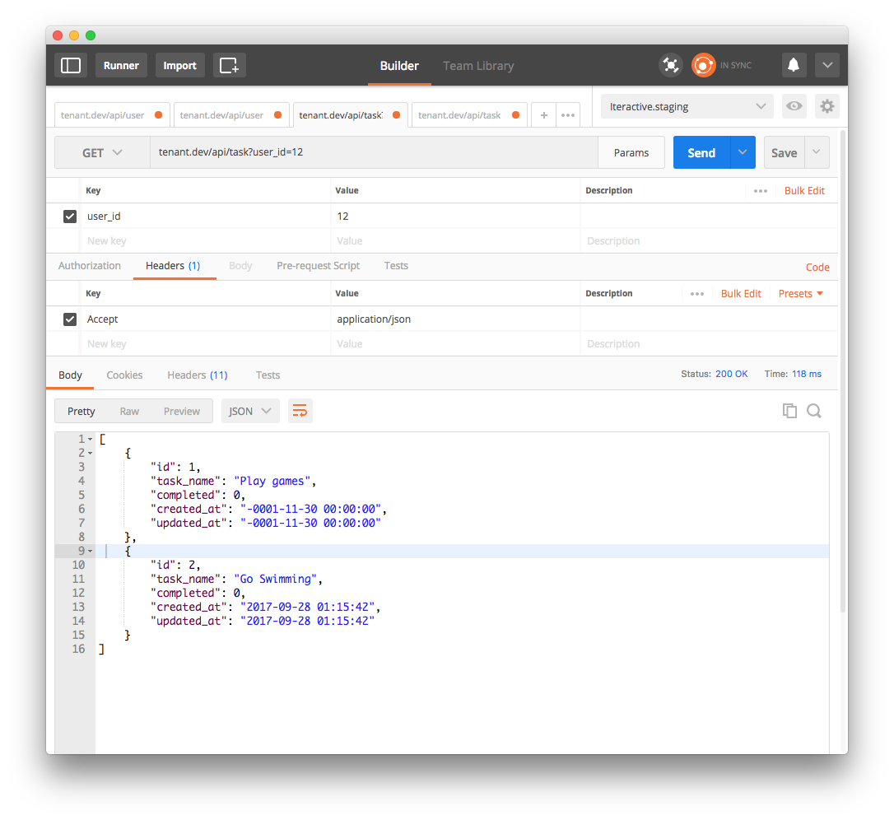

# Example on Multi Tenant Database using [orchestral/tenanti](https://github.com/orchestral/tenanti)

Simple project to create users, where each users will have its own database. The database contains tasks and logs table.

## Step 1: Installation
### Version Compatibility

Laravel  | Tenanti
:--------|:---------
 4.2.x   | 2.2.x
 5.0.x   | 3.0.x
 5.1.x   | 3.1.x
 5.2.x   | 3.2.x
 5.3.x   | 3.3.x
 5.4.x   | 3.4.x
 5.5.x   | 3.5.x@dev
 5.6.x   | 3.6.x@dev

### Installation

To install through composer, simply put the following in your `composer.json` file:

```json
{
    "require": {
        "orchestra/tenanti": "~3.4"
    }
}
```

And then run `composer install` to fetch the package.

### Quick Installation

You could also simplify the above code by using the following command:

    composer require "orchestra/tenanti=~3.4"

### Configuration

Next add the following service provider in `config/app.php`.

```php
'providers' => [

    // ...
    Orchestra\Tenanti\TenantiServiceProvider::class,
    Orchestra\Tenanti\CommandServiceProvider::class,
],
```

> The command utility is enabled via `Orchestra\Tenanti\CommandServiceProvider`.

### Aliases

To make development easier, you could add `Orchestra\Support\Facades\Tenanti` alias for easier reference:

```php
'aliases' => [

    'Tenanti' => Orchestra\Support\Facades\Tenanti::class,

],
```

### Publish Configuration

To make it easier to configuration your tenant setup, publish the configuration:

    php artisan vendor:publish

## Step 2: Setup Multi-database Connection

Open `config/orchestra/tenanti.php` and customize the drivers.

```php
<?php

return [
    'drivers' => [
        'user' => [
            'model'  => App\User::class,
            'path'   => database_path('tenanti/user'),
            'shared' => false,
        ],
    ],
];
```

## Step 3: Setup Provider

Open `app/Providers/AppServiceProvider.php` and update `boot` function. 

This will use 'tenants' connection and altering database config to use our custom prefix database name along with entiy id. In our example we use user_{id}.

```php
public function boot()
{
    User::observe(new UserObserver);

    Tenanti::connection('tenants', function (User $entity, array $config) {
        $config['database'] = "user_{$entity->id}";

        return $config;
    });
}
```

Add tenants connection in `config/database.php`

```php
'connections' => [

    'mysql' => [
        ...
    ],
    
    'tenants' => [
        'driver' => 'mysql',
        'host' => env('DB_HOST', '127.0.0.1'),
        'port' => env('DB_PORT', '3306'),
        'database' => env('DB_DATABASE', 'forge'),
        'username' => env('DB_USERNAME', 'forge'),
        'password' => env('DB_PASSWORD', ''),
        'unix_socket' => env('DB_SOCKET', ''),
        'charset' => 'utf8mb4',
        'collation' => 'utf8mb4_unicode_ci',
        'prefix' => '',
        'strict' => true,
        'engine' => null,
    ],
    
    ...
```

## Step 4: Setup Observer

Create folder and file `app/Observers/UserObserver.php` and add below code. This will add event listener when user is created, new database will be created for that user based on with name "user_{id}" (can be customized).

```php

<?php namespace App\Observers;

use Illuminate\Database\Eloquent\Model;
use Orchestra\Tenanti\Observer;

class UserObserver extends Observer
{
    public function getDriverName()
    {
        return 'user';
    }

    /**
     * Run on created observer.
     *
     * @param  \Illuminate\Database\Eloquent\Model  $entity
     *
     * @return bool
     */
    public function created(Model $entity)
    {
        $this->createTenantDatabase($entity);
        parent::created($entity);
    }
    /**
     * Create database for entity.
     *
     * @param  \Illuminate\Database\Eloquent\Model  $entity
     *
     * @return mixed
     */
    protected function createTenantDatabase(Model $entity)
    {
        $connection = $entity->getConnection();
        $driver     = $connection->getDriverName();
        $id         = $entity->getKey();
        switch ($driver) {
            case 'mysql':
                $query = "CREATE DATABASE `user_{$id}`";
                break;
            case 'pgsql':
                $query = "CREATE DATABASE user_{$id}";
                break;
            default:
                throw new InvalidArgumentException("Database Driver [{$driver}] not supported");
        }
        return $connection->unprepared($query);
    }
}
```

## Step 5: Add Tenant migration files

Use tenanti command as state in the [github](https://github.com/orchestral/tenanti#console-support)

Example:
`php artisan tenanti:make user create_tasks_table`

This will create "database/tenant/users/user_tenant_create_tasks_table.php" file.

## Lastly

### Create User (tenant)
As refer to my example API to create and listing user in `app/Http/Controllers/Api/`, the example there will create a user which will trigger the observer of User to create tenant's database.

After run the below POST request, check database and it should create a new databse for tenants along with migrations.




### Create Task for User

This is simple example to add user's task for tenant's database. 

```php
class TaskController extends Controller
{
	public function index(Request $request) {

		// to get user's task
		
		// check id - this can be replaced with Auth user / subdomain in order to 
		// determine which tenant database to use
		$this->validate($request, [
			'user_id' => 'required'
		]);
		$user = User::find($request->user_id);

		// below line can be created once at middleware
		Tenanti::driver('user')->asDefaultConnection($user, 'user_{id}');

		return Task::all();
	}

    public function store(Request $request) {
    	$this->validate($request, [
    		'user_id' => 'required'
    	]);

		$user = User::find($request->user_id);
		Tenanti::driver('user')->asDefaultConnection($user, 'user_{id}');

    	Task::create([
    		'task_name' => $request->task_namename
    	]);

        return ['status' => 'success'];
    }
}
```

To make it in middleware, just create new Middleware name example: `CompanyUser`

```php
class CompanyUser
{
    public function handle($request, Closure $next)
    {
        //check which current user
        $user = Auth::user();

        if ($user) {
            Tenanti::driver('user')->asDefaultConnection($user, 'user_{$user->id}');
        } else {
            return redirect() ->route('home.index')->withErrors('User not exists');
        }
        return $next($request);
    }
}

```





## Reference

[https://github.com/orchestral/tenanti](https://github.com/orchestral/tenanti)
[https://github.com/crynobone/todoist/compare/single-database...multi-database](https://github.com/crynobone/todoist/compare/single-database...multi-database)

## License
Licensed under the [MIT license](http://opensource.org/licenses/MIT)
